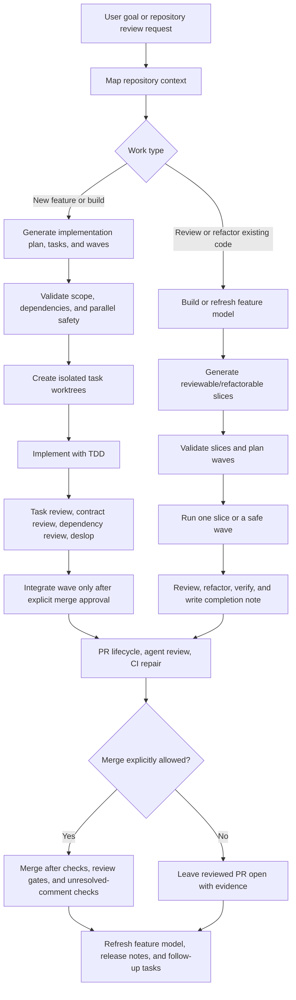

# Agentic Development System Architecture

## Purpose

The Agentic Development System is one coordinated local Codex project for building, reviewing, refactoring, and shipping repository changes. It keeps the earlier installed roots as compatibility modules, but the operating model is a single lifecycle rather than separate project tracks.

## Installed Layout

```text
~/.codex/
  AGENTS.md
  config.toml
  hooks.json
  agents/
    planner.toml
    implementor.toml
    reviewer.toml
    refactorer.toml
    integration-manager.toml
    pr-automation.toml
    deslop-reviewer.toml
    codebase-analyst.toml
    feature-modeler.toml
    slice-generator.toml
    wave-planner.toml
    slice-reviewer.toml
    slice-refactorer.toml
    wave-orchestrator.toml
    pr-review-manager.toml
    ci-debugger.toml
  agentic-dev-system/
    docs/
    skills/
    scripts/
    fixtures/
    tests/
  codebase-review-factory/
    agents/
    docs/
    hooks/
    prompts/
    schemas/
    scripts/
    skills/
    fixtures/
    tests/
~/.agents/skills/
  agentic-dev-system -> ~/.codex/agentic-dev-system/skills
  codebase-review-factory -> ~/.codex/codebase-review-factory/skills
```

The path names are compatibility details. User-facing workflow docs should refer to the whole as the Agentic Development System.

## Component Model

| Component | Responsibility | Compatibility root |
| --- | --- | --- |
| Global policy | Scope discipline, TDD expectations, worktree policy, review policy, destructive-action constraints | `~/.codex/AGENTS.md` |
| Agents | Role-specific Codex execution profiles for planning, implementation, review, refactor, PR, CI, feature modeling, and wave orchestration | `~/.codex/agents` |
| Build planning | Repository context maps, acceptance tests, task plans, wave validation, task execution, task review, integration, PR handoff | `~/.codex/agentic-dev-system` |
| Codebase intelligence | Repository inventory, feature model, reviewable slices, wave planning, slice review/refactor, PR lifecycle, CI repair | `~/.codex/codebase-review-factory` |
| Hooks | Warning-first branch, scope, slop, and stop-summary checks | `~/.codex/hooks`, `~/.codex/codebase-review-factory/hooks` |
| Schemas and fixtures | JSON contracts and validation samples for task plans, feature models, slice plans, and wave results | both compatibility roots |
| Package output | Clean zip artifacts that exclude backups and caches | generated from the workspace or `package_upload.py` |

## End-To-End Flow



## Artifact Flow

| Phase | Primary artifacts | Notes |
| --- | --- | --- |
| Context | repo map, inventory JSON, analysis markdown | Start here before planning or slicing. |
| Build planning | `plan.json`, task markdown, task CSV, waves | Used for implementation work. |
| Task execution | task branch, tests, completion note | One task per branch/worktree. |
| Review | review report, actionable comments JSON/Markdown | Review comments are converted to scoped fix prompts before edits. |
| Feature modeling | feature model JSON/Markdown | Use after initial builds and after meaningful merged changes. |
| Slice planning | slice plan JSON/Markdown, slices CSV, slice files | Used for granular review/refactor work. |
| PR/CI | PR body, review requests, CI debug notes, merge gate output | Merge remains opt-in. |

Compatibility scripts from older backups may mention historical codebase-review output paths. Active docs and helpers should prefer explicit project output paths under `docs/agentic-system/`.

## Execution Modes

### Initial Build Mode

Initial build mode starts from a user feature request or product spec. It maps repository context, writes acceptance criteria, generates PR-sized tasks, validates task scope and wave ordering, then executes tasks in isolated worktrees with TDD.

Primary skills:

- `repo-context-map`
- `acceptance-test-writer`
- `task-generator`
- `task-scope-validator`
- `wave-validator`
- `epic-orchestrator`
- `task-implementor`
- `task-reviewer`
- `integration-merge-manager`
- `commit-pr`
- `request-agent-review`

### Codebase Intelligence And Slice Mode

Slice mode starts from an existing repository or a completed build. It inventories the repository, builds or refreshes a feature model, generates bounded slices, validates parallel safety, and runs targeted review/refactor PRs.

Primary skills:

- `codebase-deep-analyzer`
- `feature-model-builder`
- `feature-model-refresh`
- `feature-slice-generator`
- `reviewable-slice-validator`
- `slice-wave-planner`
- `slice-review-workflow`
- `slice-refactor-workflow`
- `codebase-maintenance-orchestrator`
- `slice-pr-lifecycle`
- `slice-agent-review-loop`
- `slice-ci-debug-and-merge`

### Shared Review And Release Mode

Both build tasks and review slices converge on the same quality gates: deslop, task/slice review, PR creation, agent review, CI repair, explicit merge gating, and release/migration notes.

Primary skills:

- `deslop`
- `codebase-deslop`
- `api-contract-review`
- `dependency-change-review`
- `request-agent-review`
- `slice-agent-review-loop`
- `release-notes-and-migration`

## Safety Architecture

- Protected branches are blocked by mutating helpers and hooks.
- Merge defaults to planning or PR-only mode. Explicit flags are required for side-effecting merge operations.
- `--no-merge` and `--pr-only` override merge authority.
- Slice and task specs define read sets, write sets, dependencies, non-goals, invariants, and verification commands.
- Same-wave execution is allowed only after dependency and write-set safety checks.
- Hooks are warning-first by default. Strict hook behavior must be explicitly enabled.
- Packaging excludes backups, caches, bytecode, and platform junk files.

## Model Policy

The project uses an explicit local model matrix for configured agents. It does not change unrelated global Codex model settings.

- Build-planning and implementation agents use `gpt-5.5` with extra-high reasoning unless their local agent file says otherwise.
- Refactor and PR automation roles that are intentionally lighter use medium reasoning where configured.
- Slice wave orchestration and CI debugging use the model configured in their installed agent templates.
- Scripts that accept Codex extra arguments must block model, reasoning, sandbox, and dangerous override flags when policy requires it.

## Compatibility Contract

The two installed roots remain valid so existing skill discovery, tests, and scripts continue to work. New docs and package manifests should present the system as one project:

- Do not call the two roots separate product tracks.
- Treat the roots as internal compatibility modules.
- Prefer the canonical docs in `~/.codex/agentic-dev-system/docs`.
- Keep any future physical merge behind a tested migration plan.
